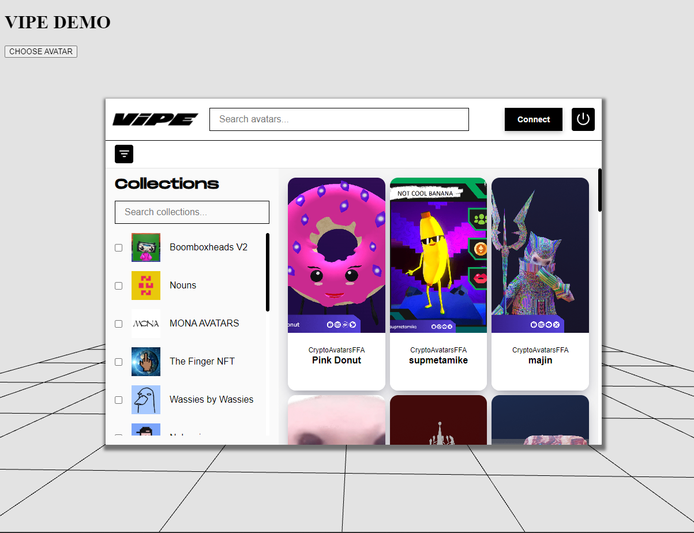

Examples using various frameworks for listing and downloading open-source avatars from vipe.io using the JS SDK. In all examples, it opens an avatar selector iframe. If you choose one and click on "use avatar," you will see how it's loaded into a 3D scene.

# VipeIO SDK

The VipeIO SDK is a library that provides access to the VipeIO platform for interacting with NFTs and digital avatars. This documentation will guide you through installation, configuration, and usage of the SDK.

## Installation

To install the VipeIO SDK, you can use npm or yarn:

```bash
npm install @vipeio/sdk
```

or

```bash
yarn add @vipeio/sdk
```

## Configuration

Before using the SDK, you need to configure it with your API Key and other relevant options:

```javascript
import { Vipe } from '@vipeio/sdk';

const vipeSdk = new Vipe({ apiKey: 'YOUR_API_KEY', avatarsPerPage: 24 });
```

## Basic Usage

### Get Open Avatars

You can retrieve a list of open avatars using the `getOpenSourceAvatars` method:

```javascript
vipeSdk.getOpenSourceAvatars()
  .then((avatars) => {
    console.log('Open avatars:', avatars);
  })
  .catch((error) => {
    console.error('Error fetching open avatars:', error);
  });
```

## Available Methods

### `getAvatar(network, contractAddress, tokenId)`

Get an avatar by network, contract address, and token ID.

### `getAvatars(filter)`

Retrieve a list of avatars based on a specific filter.

### `getOwnedAvatars(walletAddress)`

Get avatars owned by a wallet address.

### `getOpenSourceAvatars(options)`

Fetch open source avatars.

### `getAvatarsByCollection(options)`

Get avatars by collection.

### `getCollections(filter)`

Retrieve a list of NFT collections.

### `getCollection(collectionName)`

Get a specific collection by its name.

## Types and Enumerations

The SDK utilizes various types and enumerations that can be helpful in your implementation:

- `NFT`: Describes a Non-Fungible Token (NFT) with its properties.
- `NFTCollection`: Defines an NFT collection with its details.
- `NFTFilter`: Provides filtering options for NFT queries.
- `Pagination`: Contains constants related to pagination.

### Select an Avatar

To allow users to select an avatar, you can open an avatar selector, you can open it as new Window or like a dialog inside your webpage,
depending the configuration used in Vipe constructor. 

```javascript
const vipeSdk = new Vipe({
  apiKey: 'YOUR_API_KEY',
  avatarsPerPage: 24,
  avatarSelectorConfig: { mode: "iframe | window" }
});

vipeSdk.openAvatarSelector((avatar, vrmUrl) => {
  console.log('Selected Avatar:', avatar);
  console.log('VRM URL:', vrmUrl);
});
```

This will open an avatar selector UI, using Vipe login method. You will be able to enter as guest to see Open Source avatars.

#### Example page


#### Vipe oauth


#### Open source avatar


#### Owned avatars


#### Avatar details


#### Avatar loaded


## Contribution

We welcome contributions! If you'd like to enhance this library, fork it and submit a pull request.

## Support

If you need assistance or have any questions, feel free to contact us at [hello@vipe.io](mailto:hello@vipe.io).

## License

This project is licensed under the MIT License
